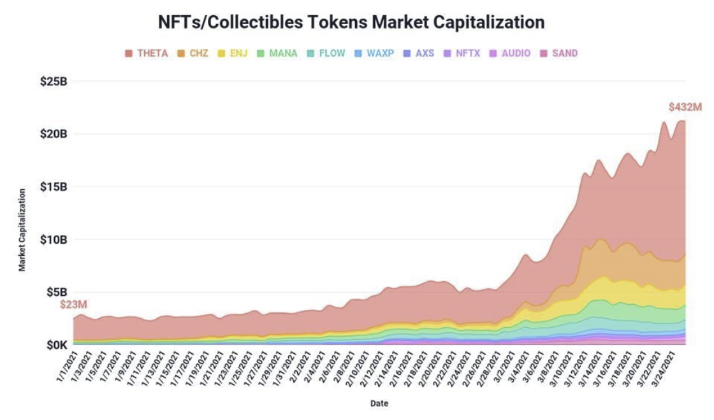

# Abstract

In today's new age of technology and innovation, digital goods, crypto assets, and NFT collectibles have taken the marketplace by storm, making their way into the homes of millions of digital enthusiasts eager to claim their place inside of these highly disruptive industries. With the total market cap of NFTs sitting around $51.3 billion, it's no surprise why mega Fortune 500 companies like Pepsi, McDonald's, Ray-Ban, and Gucci have decided to dive headfirst into this constantly evolving space. The demand for virtual land and digital collectibles only continues to grow stronger by the day with no signs of slowing down.

# How Is Metagate Different?

With the cryptocurrency and NFT market growing at a rapid rate, it can become challenging to keep up with the new landscapes of opportunities, social interactions, and technological developments. Metagate was born out of a deep desire to create the ultimate crypto, NFT, and Metaverse experience. Step into the Metagate portal to embark on an epic adventure across a multiverse filled with endless opportunities for the avid collectors and web3 builders. Collect rare NFTs from some of the world's best curated artists, participate in exclusive IMOs (Initial Metaverse Offering) through our cutting-edge Launchpad, and stake your $MGT to get early access to the hottest NFT drops in the space.
