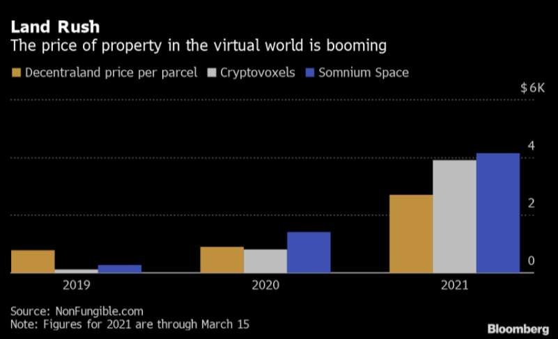

# Virtual Land Sales

It's 2022, and investors and digital enthusiasts are paying millions of dollars for virtual land sold in the form of plots from all corners of the metaverse. With virtual worlds and platforms paving the way for a new era of collecting and investing, it's no surprise that these projects continue to break sales records as the new leading commodity in the crypto and NFT space.

