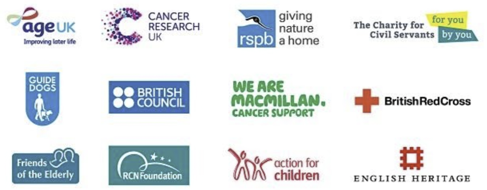

# Charitable Partners

At Metagate, we are firm believers that the choices we make and the lifestyles we live have a profound impact on our planet. That's why we have decided to dedicate a portion of the Metagate charity pool to help support the fight against offsetting carbon emissions and reducing the size of our global footprint. On top of that, our DAO governance model will put our NFT holders in the driver's seat of choosing future charitable organizations to partner with, allowing for their voices to be heard across the multiverse and beyond. This approach is achieved through our innovative DAO voting system, where we'll present you with the top charities that we feel align with our core values, belief, and brand.

We are excited to plug our users into an experience that allows them to not only explore and evolve the digital metaverse but also provide them with peace of mind knowing that their support and contributions are truly making a difference in the physical world we live in.

