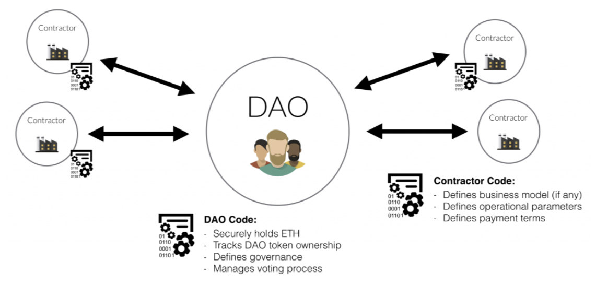

# DAO Governance and Voting

## DAO Governance

In the fast-paced world of NFTs, DAO's (Decentralized Autonomous Organizations) have become an integral part of any project that hopes of having a long-term and sustainable future. A DAO is an organization run by a group of users with equal access and opportunity. All rules, decisions, and transactions are recorded directly on the blockchain while embodying the core values of decentralization. At Metagate, we strive to bring together a collective hive of people with similar passions and interests, ensuring that the project's growth is fueled and powered by the ones who matter most, the community.

## DAO Voting System

Our community's needs, desires, and opinions remain at the forefront of everything we do. That's why we have implemented a highly engaging system where members of our DAO can vote on an array of different avenues. Our DAO voting system serves as an open line of communication with our community to help us identify, approach, and evolve the future of the Metagate ecosystem. From choosing the next best Metaverse project to casting votes for your favorite world-class digital artist, our unique DAO voting system empowers the end-user with the platform and mechanics to share their valued opinions, creative suggestions, and intuitive improvements.
