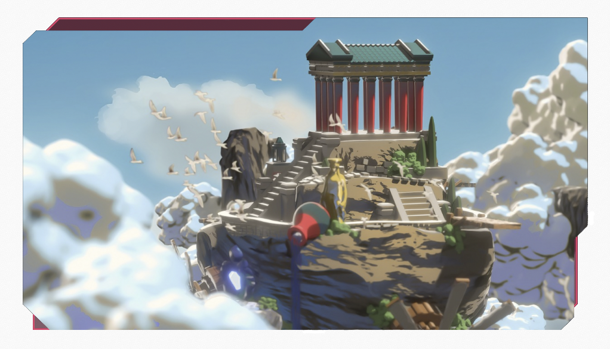

# The Seed: Aetherya

Our first project is the seed for the LaunchPad. Aetherya is a lush, beautiful world with a wide variety of biomes. Each district will be unique, some in deserts, others in the sea, some floating in air.

The first district is Sky Islands, featuring high quality houses built on free-floating rocks. As with all districts, you will receive two NFTs, one property and one avatar.

Use your property as your homebase in the metaverse. Take advantage of built-in social features (coming soon). Show your NFTs to your friends — and the world — through Twitter integration. Chat one-to-one or host a global event _at your place_ in the metaverse.

# But there is more... (coming soon)

Aetherya is actually the place of the epic battle between good and evil. The protectors of the Flames of Creation must defeat the attacking monsters.

The evil Krotoan Horde is set to capture beautiful Aetherya, and what's worse, the Crystals. Each property in Aetherya has Crystals that power the generation and evolution of the monsters. You can use the $Aether generated by the Crystals to spawn your own monsters.

Take them to roam the lands of Aetherya and complete quests fighting back the Krotoan monsters. Or spar with other Aetheryans to gain experience and earn more $Aether.
