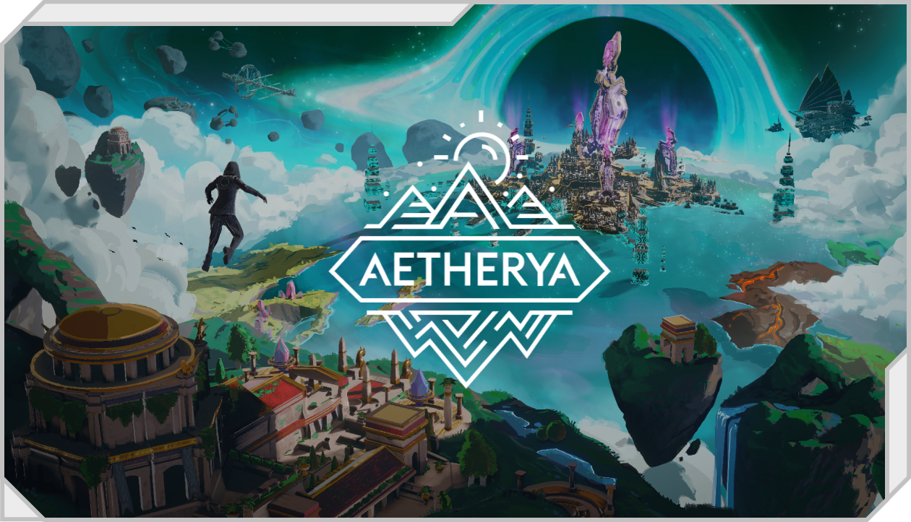

# LaunchPad

It is a complex and tedious process to launch a quality NFT collection. This is true indeed for all art projects: there is the technique and there is the grind. Technology needs to fit neatly together. Renders have to reflect the artist's intent. Traits have to be randomised with the right rarities.

And most importantly, all visual elements have to be designed with meticulous detail.

By developing the LaunchPad, we hope to help other artists bring to life their ideas, too.

We have developed and will continue to develop the technology that enables all this. Build the components of the ecosystem that artists can add to their projects to make them more attractive to their fans.

Indeed, fans will play a key role: they will be able to select the upcoming projects for the LaunchPad.

And here is the first world:

