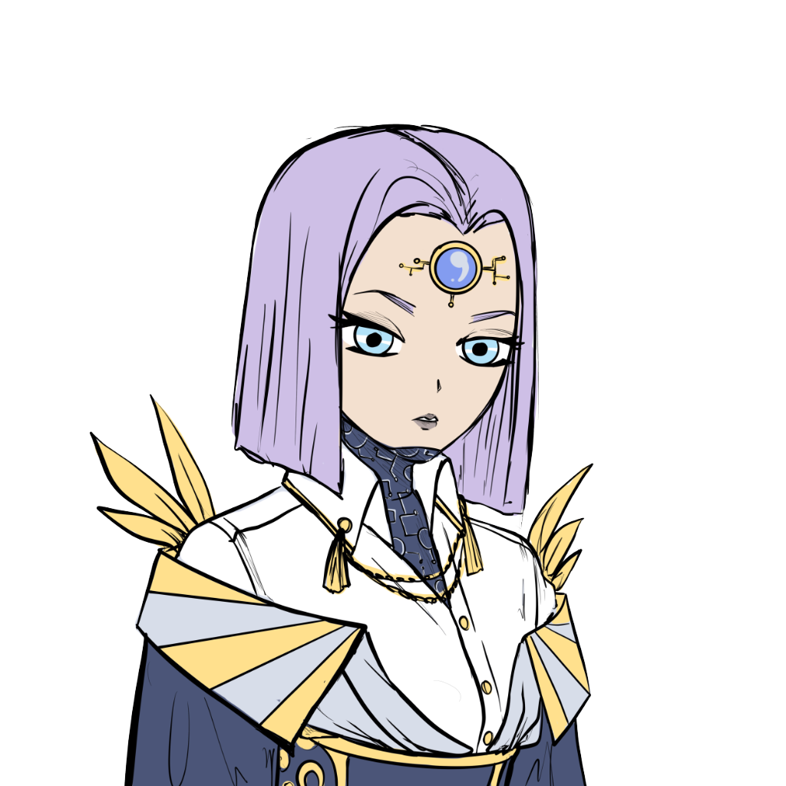

# Avatars of Aetherya

Each district is populated by different denizens and as a first-time buyer, you get an avatar with the property.

You can use the Avatars of Aetherya as all other avatar NFTs, including selling them. They are not linked to the properties after minting.

