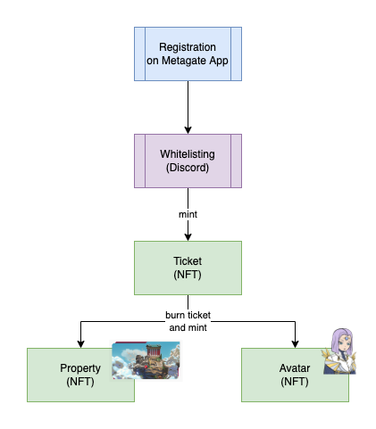
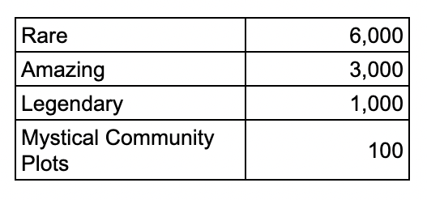

# NFTokenomics

## Obtaining NFTs

Tickets can be obtained by minting them after getting whitelisted. Tickets are priced at USDT 500 or ETH 0.16. Each ticket entitles the owner to mint one property and one avatar NFT.

There is a number limit for obtaining tickets. However, there is no time limit when the ticket holder has to burn the ticket and mint the NFTs.

## Security

The tokenID of the ticket will correspond to the tokenIDs of the property and avatar NFTs. We will publish the SHA256 hashes of the property and avatar NFT traits in the ticket NFT. By publishing the hash, the NFTs cannot change between ticket minting and NFT minting.

The actual NFTs will be revealed at the time of their minting. Metadata and resources are hosted on industry-leading AWS infrastructure allowing for high availability.

## Rarities

There are four levels of rarity for each district:

Mystic Community Plots will be sold separately to interested collectors. See related Property features.

## Team Incentives

About 2% of each district will be reserved for team incentives. This corresponds to about 200 NFTs. We share this with our development and art teams so that they participate in the success of their work.

Example:

## Compliance

None of the NFTs are, nor intended to be, payment tokens or securities.

They represent value, as all art does, and my have a sales value as such. When buying the pre-paid ticket NFT, you obtain the right to mint the art NFTs. This is the same as when you would obtain the right to ride the bus with a pre-paid bus ticket.
