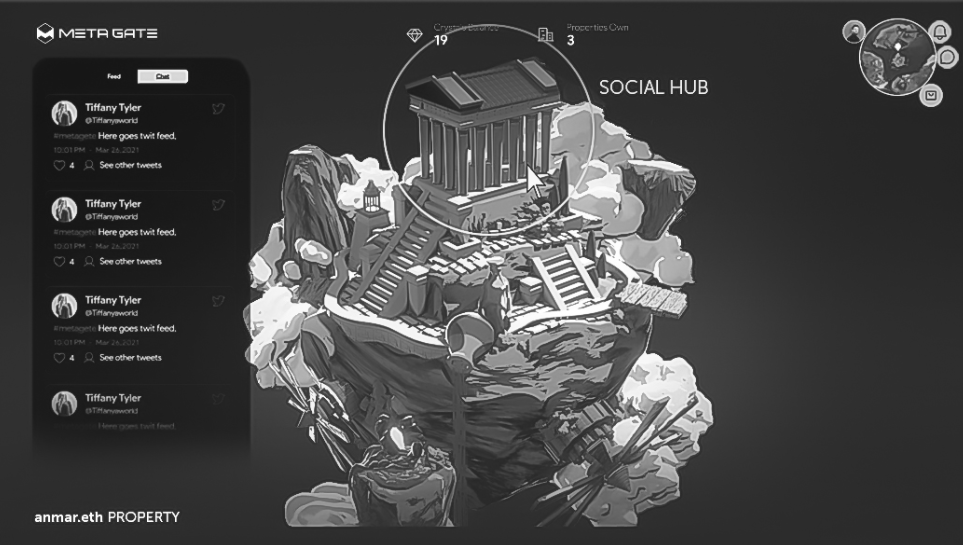

# Aetherya Properties

Each property in Aetherya has a unique flavour imparted by the district it is in and by its unique traits.

For example, Sky Islands properties are built on free floating rocks. There are several combinations of houses and garden features, like fountains and statues.

In addition, each property will be your key to access social and gaming features. You don't need to take part in either, though, it's up to you. Your NFT will not lose any value.

## Social Features (coming soon)

Your beautiful property can serve as your hub in the metaverse.

Each property will allow the owner to invite guests for live text or audio chat. It will also be possible to host public or ticketed events for large audiences.

## Gaming (coming soon)

The dark clouds are gathering, but there is little known, yet, about the Krotoan Horde menacing Aetherya.

Watch this space for details on the game and play-to-earn features.

## Rentals

You can also rent out your property and earn money. On the Metagate App you will be able to enable rentals, get offers and sign the contract.

During the rental period, the renter can use the social and game features linked to the property.

While the property is rented, the owner will show as the renter. It will not be possible to sell the property during the rental period. Landlords and renters can also agree to end a rental early.

## Mythical Community Plots (coming later)

Enterprising collectors will be able to obtain a very limited number of community plots. These plots will have many rental apartments and the collectors will become landlords. Each rental apartment will have a key. The landlord can rent the apartments to gamers, who do not wish to buy a property, but still want to play (and earn).
