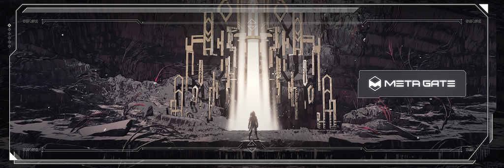

# What We Do

We love beautiful art.

We love digital art.

We want to merge beautiful digital art into every day we spend in the metaverse.

Non-Fungible Tokens (NFTs) rapidly gaining ground as a means of making real art accessible to everyone.
Metagate opens up an independent metaverse of worlds. Worlds inhabited by beautiful people surrounded by beautiful art.

And we love games. So prepare to be surprised!

# Overview

Enter through Metagate to experience the metaverse and NFTs in a new way.
Own your home... castle... spaceship in the metaverse that serves as your homebase,
where you can use social features to talk to friends, show your NFT collection or even hold public events. Right there, in one place.

We are building the metaverse one world at a time.
We are building Aetherya, an immense world of beauty, diversity and fun.
In Aetherya, your homebase is also your key to the upcoming play-to-earn (P2E) games.

But we won't stop here.
We are working with artists, who have amazing new ideas for new worlds and new experiences.
We will be expanding our launchpad... but we need your help.

Through our upcoming $METAGATE token, you will be able to help select the next idea.
You will be able to vote for artists and projects to support and deploy through the Metagate
and so help build the metaverse of beauty.

Let's take a look!

